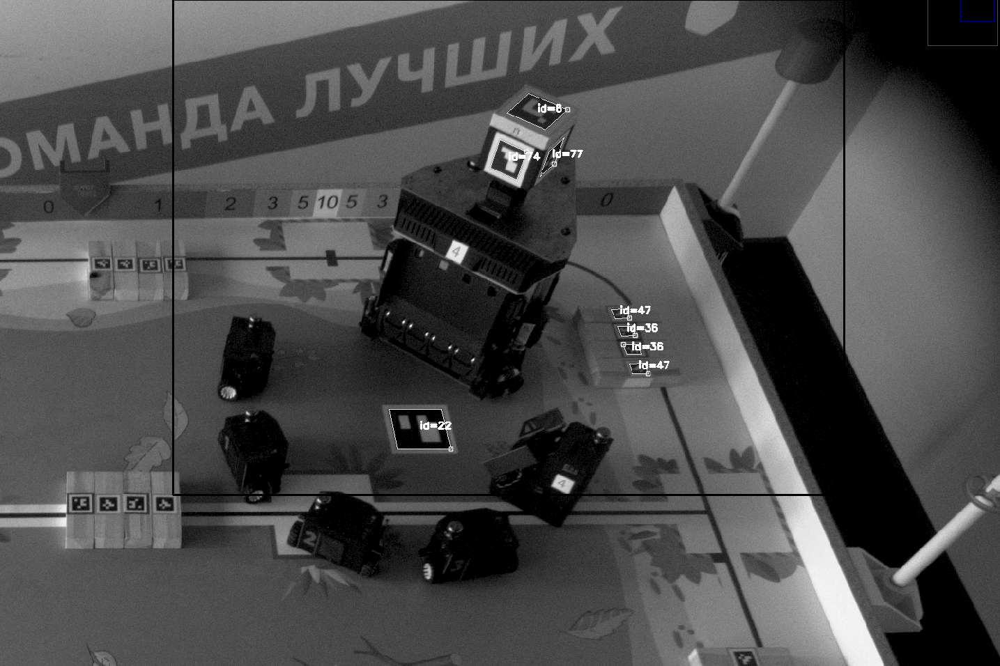
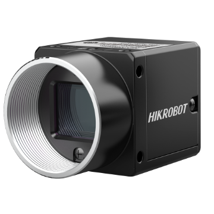
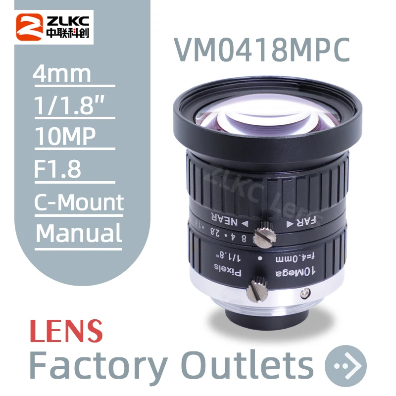
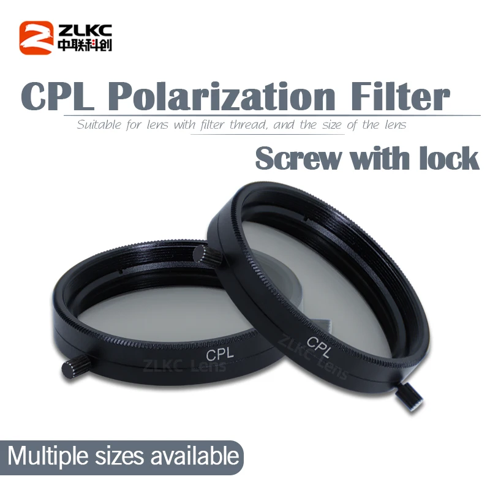

# Eurobot 2026 external camera

## Hardware

| Equipment | Store Link |
| :---: | :---: |
|  | [MV-CS060-10UC-PRO](https://www.hikrobotics.com/en/machinevision/productdetail/?id=5716)   [aliexpress](https://ali.click/cupmc12) |
|  | [ZLKC VM0418MPC lens](https://zlkc.com.cn/en/pro.php?id=741)   [aliexpress](https://ali.click/44rmc14) |
|  | [ZLKC CPL filter](https://ali.click/ktqmc1q) |

## Prerequisites

You must have the following dependencies installed:

* **OpenCV** (`opencv-contrib-python`) – core library for computer vision algorithms and ArUco marker detection.
* **Harvesters** (`harvesters`) – required for image acquisition from GenICam compliant industrial cameras.
* **SciPy** (`scipy`) – used for spatial transformations.
* **NumPy** (`numpy`) – for matrix and array manipulations.
* **PyYAML** (`PyYAML`) – for parsing configuration files.

## Key features

This repository provides a comprehensive toolset for external camera processing, featuring the following key algorithms:

* **Camera Calibration Tools**: Built-in support for removing lens distortion using multiple models:
  * **Radial-Tangential**: Standard distortion model with support for 5 or 8 coefficients.
  * **Kannala-Brandt**: Fisheye distortion model highly suitable for wide-angle lenses.
* **Fast Robot Tracking (Dynamic ROI)**: Significant performance optimization is achieved by restricting the marker search area to a dynamic Region of Interest (ROI) around the robot. This increases the detection speed from **20 fps** at full resolution to **60 fps** within a 1000x1000 px window.
* **Robust Pose Estimation**: Calculates the robot's coordinates and orientation (6D pose) by solving the **PnP** (Perspective-n-Point) problem based on the detected marker array.
* **Automated Field Pose Initialization**: Determines the static camera-to-field transformation matrix by detecting fixed field markers and averaging iterative PnP results over multiple frames for high precision.
* **Pantry State & Dominance Checker**: Automatically projects 3D pantry zone coordinates onto the 2D image plane to examine specific localized ROIs. It identifies scored elements inside the pantries, computes current scores, and determines zone dominance while utilizing a robust memory buffer to handle temporary marker tracking losses.

## Calibration tool

The repository includes a dedicated tool for calibrating your camera using a ChArUco board. It is located in the `calibration/` directory.

### How to use
1. **Place your images:** 
   * Put the photos of your calibration board into the `calibration/calibration_dataset/` directory. 
   * Alternatively, if you are using ROS 2, you can extract frames from a bag file (set `USING_ROS2_BAG = True` and configure `bag_file_path` and `TOPIC_TO_PARSE`).
2. **Configure the board:** Adjust the parameters of your ChArUco board (dimensions, square size, marker size, dictionary) in `calibration/config/ChArUco_board.yaml`.
3. **Run the script:** Execute `calibration/camera_calibration.py`.

### Adjustable flags
Inside the `camera_calibration.py` script, you can tweak several flags in the "Calibration configuration" section:
* `DISPLAY_DETECTED_MARKERS`: `True`/`False` – show images with successfully detected markers during the process.
* `DISPLAY_UNDISTORTED`: `True`/`False` – display the final undistorted images to verify calibration quality.
* `USE_8_COEFFS`: `True`/`False` – use 8 distortion coefficients for the Radial-Tangential model (otherwise, 5 are used).
* `USING_ROS2_BAG`: `True`/`False` – parse images directly from a ROS 2 bag file instead of the local folder.

### Outputs
Upon successful calibration, the intrinsic matrices and distortion coefficients for both Radial-Tangential and Kannala-Brandt models are automatically saved into `calibration/intrinsics/intrinsics.yaml`.

## Notes

In the final production implementation deployed on the robot, this camera solution was divided into two specialized packages to maximize performance:
1. **C++ Package**: A highly optimized module dedicated exclusively to acquiring raw frames from the industrial camera and compressing them into JPEG format.
2. **Python Package**: A higher-level logic module responsible for determining the pose (position and orientation) of our robot and the enemy robot, as well as checking the dominance of the wooden blocks on the playing field.
